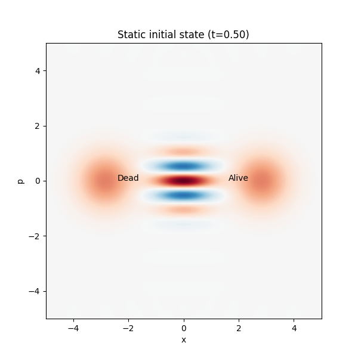
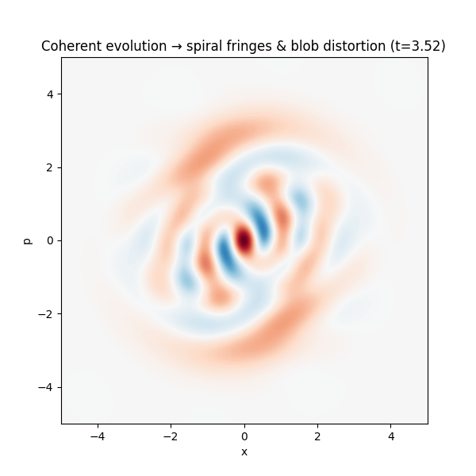
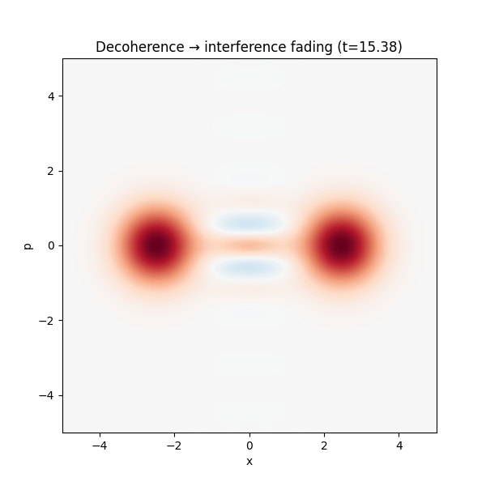
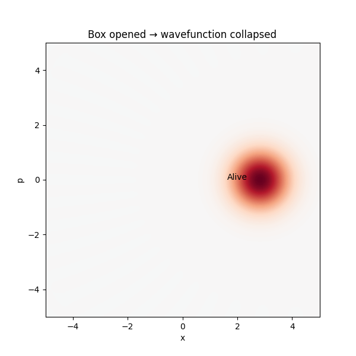

# Schrödinger’s Cat Simulation

This repository contains a **Python-based simulation of Schrödinger’s cat**, a famous quantum mechanics thought experiment, using the **QuTiP** library.

The simulation visualizes the quantum superposition of a cat being *alive* and *dead* in phase space via the **Wigner function**, showcasing:

* **Coherent evolution**
* **Decoherence**
* **Wave function collapse**

---

## 📖 Overview

Erwin Schrödinger’s 1935 thought experiment illustrates the paradoxical nature of quantum superposition when applied to macroscopic objects:

* A cat is sealed in a box with a radioactive atom, a Geiger counter, and a vial of poison.
* If the atom decays (50% probability), the poison is released → the cat dies.
* Until observed, quantum mechanics suggests the cat exists in a **superposition of alive and dead**.

This simulation models a **quantum analog of the cat state** using a **coherent state superposition** in a harmonic oscillator, visualized through the **Wigner function in phase space**.

It demonstrates:

* Coherent evolution under a Kerr Hamiltonian → twisting interference patterns
* Decoherence due to environmental interactions → fading quantum interference
* Interactive collapse via key press → mimicking measurement

---

## 🧮 Mathematical Background

The simulation is based on a quantum harmonic oscillator with Hilbert space dimension:

$$
N = 30
$$

### Initial Cat State

The Schrödinger cat state is a superposition of two coherent states:

$$
|\psi_\text{cat}\rangle = \frac{1}{\sqrt{2 \,(1 + e^{-2|\alpha|^2})}} \Big( |\alpha\rangle + |-\alpha\rangle \Big), \quad \alpha = 2.0
$$

where $|\alpha\rangle$ and $|-\alpha\rangle$ are coherent states with amplitudes $\alpha$ and $-\alpha$.

The corresponding density matrix is:

$$
\rho_0 = |\psi_\text{cat}\rangle \langle \psi_\text{cat}|
$$

---

### Wigner Function

The **Wigner function** $W(x,p)$ represents the quantum state in phase space, computed over a grid:

$$
x, p \in [-5, 5]
$$

* Two Gaussian peaks → “Alive” ($x \approx 2$) and “Dead” ($x \approx -2$)
* Interference fringes → signature of quantum superposition

Decomposition of the Wigner function:

$$
W(x,p) = \frac{1}{\mathcal{N}^2} \Big[ W_\alpha(x,p) + W_{-\alpha}(x,p) + W_\text{interf}(x,p) \Big]
$$

where:

* $W_\alpha(x,p)$ = Wigner function of $|\alpha\rangle$
* $W_{-\alpha}(x,p)$ = Wigner function of $|-\alpha\rangle$
* $W_\text{interf}(x,p)$ = interference term
* $\mathcal{N}^2 = 2(1 + e^{-2|\alpha|^2})$

---

## Simulation Phases

### 1. Coherent Evolution (t = 2 → 10)

The state evolves under a **Kerr Hamiltonian**:

$$
H_\text{Kerr} = \kappa \, (a^\dagger a)^2, \quad \kappa = 0.1
$$

* Non-linear shearing causes interference fringes to **twist into spirals**
* Gaussian blobs **distort** in phase space

---

### 2. Decoherence (t = 10 → 20)

After resetting to $\rho_0$, decoherence is applied via **amplitude damping**:

$$
c = \sqrt{\gamma} \, a, \quad \gamma = 0.05
$$

* No Hamiltonian applied ($H = 0$)
* Interference fringes **fade away**, leaving stationary blobs
* System resembles a **classical mixture**:

$$
\rho_\text{decoh} \approx \frac{1}{2} \Big( |\alpha\rangle \langle \alpha| + |-\alpha\rangle \langle -\alpha| \Big)
$$

---

### 3. Collapse (Interactive Measurement)

Pressing **“o”** collapses the wave function to:

$$
|\psi_\text{cat}\rangle \to
\begin{cases}
|\alpha\rangle & \text{"Alive"} \\
|-\alpha\rangle & \text{"Dead"}
\end{cases}
$$

The plot updates with a single labeled blob: **Alive** or **Dead**.

---

## 🔍 Interpreting the Results

* **t = 0 → 2 (Static Display):**
  Two blobs (“Alive” at $x \approx 2$, “Dead” at $x \approx -2$) with straight interference fringes.

* **t = 2 → 10 (Coherent Evolution):**
  Kerr Hamiltonian twists fringes into spirals, blobs distort.

* **t = 10 → 20 (Decoherence):**
  Fringes fade, blobs remain stationary → classical mixture.

* **Collapse (press “o”):**
  Single blob remains, labeled Alive or Dead.

---

## 🌌 Quantum Interpretations

* **Copenhagen:** Collapse occurs on measurement (“o” key)
* **Decoherence:** Environmental interaction destroys interference (phase 2)
* **Other views:** Many-Worlds, Bohmian Mechanics, QBism also consistent but not explicitly modeled

## Quantum Mechanics Timeline

The following timeline summarizes key milestones in quantum mechanics, highlighting contributions directly relevant to Schrödinger’s Cat (🐱) and tools used in modern simulations like the one described above (🛠️).

| Relevance       | Year | Figure                  | Contribution                                                      |
| --------------- | ---- | ----------------------- | ----------------------------------------------------------------- |
|                 | 1900 | Planck                  | Quantum Hypothesis ("Revolutionary against his will")             |
|                 | 1905 | Einstein                | Photoelectric Effect (light as quanta)                            |
|                 | 1913 | Bohr                    | Atomic Model (quantized orbits)                                   |
|                 | 1925 | Heisenberg              | Matrix Mechanics (observables, not orbits)                        |
| 🐱🛠️           | 1926 | Schrödinger             | Wave Mechanics (wavefunction dynamics)                            |
| 🐱              | 1926 | Born                    | Probabilistic Interpretation (wavefunction → probability)         |
| 🐱              | 1927 | Bohr/Heisenberg         | Copenhagen Interpretation (measurement & observer)                |
|                 | 1928 | Dirac                   | Uniting QM with special relativity (prediction of antimatter)     |
| 🐱              | 1932 | von Neumann             | Mathematical Foundations (axioms, measurement theory)             |
| 🐱🛠️           | 1932 | Wigner                  | Phase-space interpretation (Wigner function, quasi-probabilities) |
| 🐱              | 1935 | Einstein-Podolsky-Rosen | EPR Paradox (QM works, but is it complete? — still debated)       |
| 🐱              | 1935 | Schrödinger             | Schrödinger’s Cat (paradox of superposition)                      |
| 🐱🛠️           | 1970 | Zeh                     | Decoherence Theory (quantum-classical transition)                 |
| 🐱🛠️           | 1980s–2003 | Zurek           | Decoherence and Quantum-Classical Transition (pointer states)     |

**Legend**:  

* 🐱: Directly relevant to Schrödinger’s Cat (superposition, measurement, entanglement).  
* 🛠️: Relevant as a tool for modern simulations (e.g., wave mechanics, Wigner function, or decoherence used in QuTiP visualizations).

---

## 📚 References

* N. Lambert et al., *QuTiP 5: The Quantum Toolbox in Python*, arXiv:2412.04705 (December 6, 2024). [https://arxiv.org/abs/2412.04705](https://arxiv.org/abs/2412.04705)
* QuTiP: [https://qutip.org](https://qutip.org)
* Schrödinger, E. (1980). *The present situation in quantum mechanics*.
(J. D. Trimmer, Trans.).  
Proceedings of the American Philosophical Society, 124(5), 323–338. (Original work published 1935)
* Wigner, E. P. (1932). On the quantum correction for thermodynamic equilibrium. Phys. Rev., 40, 749–759.
* Zeh, H. D. (1970). *On the Interpretation of Measurement in Quantum Theory.* *Foundations of Physics* 1, 69–76.
* Zurek, W. H. (2003). *Decoherence and the Transition from Quantum to Classical.* [https://doi.org/10.48550/arXiv.quant-ph/0306072](https://doi.org/10.48550/arXiv.quant-ph/0306072)
* Becker R. (2025). Seeing Quantum Weirdness. Medium.  
  <https://medium.com/@ratwolf/seeing-quantum-weirdness-e977d97a3214>

---

## Schrödinger's Cat Simulation technical FAQ

### Q: Why are the red blobs darker during decoherence?

A: This is a visualization effect to highlight the transition, not a physical change. The darker red results from the color scaling (vmin and vmax based on the maximum absolute Wigner value), which emphasizes the remaining amplitude after interference fades.

### Q: Why do the blobs shift slightly during decoherence?

A: In the simulation, amplitude damping with gamma = 0.05 may cause a slight contraction or shift of the initial coherent states toward the origin due to energy loss, a physical decoherence effect. In reality, this effect might be much smaller, depending on the physical system's decoherence rate.

### Q: Are the interference fringes correct?

A: Yes, the sparse fringes reflect the Wigner function’s quantum interference for alpha = 2.0. Adjust alpha or grid size (x, p) in the parameters to explore.

### Q: Is the time step (dt) accurate?

A: With 200 timesteps over 20 units, dt (~0.1) is sufficient. Increase timesteps for higher precision

### Q: Is amplitude damping the only decoherence model?

A: In this simulation, amplitude damping is the default decoherence model, implemented with a collapse operator (c_ops_decoherence) and a damping rate of gamma = 0.05. However, you can modify c_ops_decoherence in the code to include other decoherence models, such as dephasing, to explore different dynamics.

### Q: Is the Wigner function properly normalized?

A: Yes, QuTiP’s wigner ensures normalization. The vmin and vmax in contourf capture the full range—see the plotting section.

### Q: How does collapse work?

A: Pressing 'o' randomly selects a pure state (psi1 or psi2), simulating measurement per the Copenhagen interpretation.

### Q: Can I improve accuracy with higher N or grid resolution?

A: Yes, increase N (currently 30) or x, p grid (currently 130) in the parameters, though it may slow performance.
